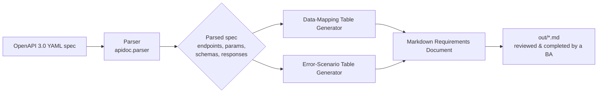

# API Requirements Documentation Kit

A small Python toolkit that turns a machine-readable **OpenAPI 3.0 specification**
into a human-readable, **Business-Analyst-style API Integration Requirements
Document** (Markdown) — complete with data-mapping tables, business-rule
placeholders, and a structured error-scenario table generated straight from
the spec's documented response codes.

> **Disclaimer:** This is an independently written, representative portfolio
> project built entirely with a synthetic example API specification. It does
> not contain, reproduce, or reference any employer's proprietary API, code,
> or systems.

---

## The problem this solves

When a business team integrates with a REST API — whether it's an internal
service or a vendor's — a Business Analyst is usually the person who has to
bridge two audiences at once:

- **Developers**, who need precise, field-level detail: exact names, types,
  required/optional status, and every documented error code.
- **Business stakeholders**, who need to understand *why* each piece of data
  matters, what business rules govern it, and what happens when something
  goes wrong (a duplicate customer, a conflicting update, a downstream
  outage).

The technical source of truth for an API is usually an OpenAPI/Swagger YAML
file. It is precise, but it is written for tooling, not for a requirements
review meeting. Re-typing an OpenAPI spec into a Word document by hand is
slow, error-prone, and immediately goes stale the moment the spec changes.

**This kit automates the first draft.** It parses the OpenAPI spec once and
generates a structured Markdown requirements document that a BA can then
review, annotate, and finalize — instead of starting from a blank page. Any
place where the spec doesn't carry enough business context to explain a
field on its own is clearly flagged with a `[BA TO COMPLETE: ...]`
placeholder, so nothing is silently guessed at and nothing important is
missed during review.

## Architecture



1. **Parser** (`apidoc/parser.py`) reads the OpenAPI YAML file, resolves
   `$ref` links into `components.schemas`, and extracts a plain, dependency-free
   representation of every endpoint: HTTP method, path, parameters, request
   body fields, and every documented response (success and error).
2. **Generator** (`apidoc/generator.py`) renders that representation into
   Markdown: one section per endpoint, each with a business-purpose summary,
   a request data-mapping table, a response data-mapping table, a
   business-rules placeholder, and an error-scenario table.
3. **CLI** (`apidoc/cli.py`, run via `python -m apidoc`) wires the two
   together into a single command.

## Tech stack

| Layer | Choice | Why |
|---|---|---|
| Language | Python 3.10+ | Widely available, easy to read for a non-engineer reviewing the code |
| Spec parsing | [PyYAML](https://pyyaml.org/) | Lightweight, well-trusted YAML parser; a full OpenAPI object-model library was deliberately avoided so the extraction logic stays simple, auditable, and easy to extend |
| CLI | `argparse` (standard library) | No extra dependency needed for a two-command CLI |
| Testing | `pytest` | Standard, readable test syntax |
| Packaging / running | Plain `pip` + `requirements.txt`, plus a `Dockerfile` | Runs the same way locally or in CI |
| CI | GitHub Actions | Runs the test suite (and a generation smoke test) on every push/PR across three Python versions |

## Installation

```bash
git clone <this-repository-url>
cd api-requirements-doc-kit

python3 -m venv .venv
source .venv/bin/activate        # on Windows: .venv\Scripts\activate

pip install -r requirements.txt
```

## Usage

Generate a requirements document from the bundled synthetic example spec:

```bash
python -m apidoc generate \
    --spec examples/customer_profile_api.yaml \
    --output out/customer_profile_api_requirements.md
```

Run it against your own OpenAPI spec the same way — just point `--spec` at
your file:

```bash
python -m apidoc generate --spec path/to/your_api.yaml --output out/your_api_requirements.md
```

Add `-v` (before the subcommand) for verbose/debug logging:

```bash
python -m apidoc -v generate --spec examples/customer_profile_api.yaml --output out/customer_profile_api_requirements.md
```

### Running with Docker

```bash
docker build -t apidoc .
docker run --rm -v "$PWD/out:/app/out" apidoc
```

### Running the tests

```bash
pytest -v
```

## Example output

The example spec (`examples/customer_profile_api.yaml`) describes a fully
synthetic **Customer Profile API** — a fictional service with three
endpoints (`GET /customers/{id}`, `POST /customers`, `PATCH /customers/{id}`)
used purely to demonstrate the tool. Running the command above against it
produces `out/customer_profile_api_requirements.md`, which is committed to
this repository so it can be reviewed without running anything.

Below is a real excerpt from that actual generated file — a data-mapping
table and the error-scenario table for the `POST /customers` endpoint:

> #### Request Data Mapping
> _Required in every request._
>
> | Field | Type | Required? | Business Meaning |
> |---|---|---|---|
> | firstName | string | Yes | The customer's legal first name. |
> | lastName | string | Yes | The customer's legal last name. |
> | emailAddress | string (email) | Yes | The customer's primary email address used for account communications. |
> | phoneNumber | string | No | The customer's primary contact phone number, in E.164 format. |
> | dateOfBirth | string (date) | No | The customer's date of birth, used for identity verification. |
> | preferredContactMethod | string, one of: EMAIL, PHONE, MAIL | No | The channel the customer has indicated they prefer to be contacted through. |
> | externalReferenceNumber | string | No | A business-assigned reference number used to correlate this profile with records in other internal systems. |
>
> #### Error Scenarios
> | Status Code | Meaning | When It Occurs (per spec) | Business Handling |
> |---|---|---|---|
> | 400 | Bad Request - Client/Validation Error | The request body failed validation, such as a missing required field or an invalid date of birth format. | [BA TO COMPLETE: describe how the business expects this scenario to be handled, e.g. user-facing message, retry policy, or escalation.] |
> | 409 | Conflict | A customer profile already exists with the same unique business identifier (for example, the same email address or external reference number). | [BA TO COMPLETE: describe how the business expects this scenario to be handled, e.g. user-facing message, retry policy, or escalation.] |
> | 500 | Internal Server Error | An unexpected internal error occurred while creating the customer profile. | [BA TO COMPLETE: describe how the business expects this scenario to be handled, e.g. user-facing message, retry policy, or escalation.] |

See [`out/customer_profile_api_requirements.md`](out/customer_profile_api_requirements.md)
for the complete document, covering all three endpoints.

## Limitations & future enhancements

This is a portfolio-scale demonstration, not a production documentation
platform. Known limitations, and how a fuller version could address them:

- **Single content type.** Only `application/json` request/response bodies
  are parsed. A future version could also handle `multipart/form-data` and
  `application/x-www-form-urlencoded`.
- **Local `$ref` only.** The parser resolves references within the same
  file (`#/components/schemas/...`). Specs split across multiple files
  (external `$ref`s) are not currently supported.
- **Shallow nested-object flattening.** Nested object/array properties are
  shown as a single row (e.g. `type: object`) rather than being recursively
  expanded into their own sub-tables. For deeply nested payloads, a future
  version could add per-object sub-tables.
- **No OpenAPI validation.** The parser trusts that the document is
  reasonably well-formed OpenAPI 3.0 and focuses on clear errors for the
  specific gaps it depends on (missing `info`/`paths`, unresolved `$ref`s,
  operations with no documented responses). A production tool would likely
  layer in a full JSON Schema / OpenAPI validator for stricter upfront
  checks.
- **Markdown only.** Output is Markdown by design (easy to review in a pull
  request or paste into a wiki). Exporting directly to Word/Confluence is a
  natural next step.
- **Placeholder-driven, not AI-generated.** Business meaning that isn't
  already in the spec is left as an explicit `[BA TO COMPLETE: ...]`
  placeholder rather than guessed at, by design — a real requirements
  document should never present an assumption as a documented fact.

## Security considerations

- This tool **only ever reads a static OpenAPI specification file**. It
  makes no live API calls, sends no network requests, and never touches
  real API credentials, tokens, or live customer data. There is nothing in
  this codebase that could accidentally call a real endpoint.
- The example spec in `examples/` is 100% fictional: invented field names,
  invented business domain, invented error scenarios. No real system names,
  hostnames, credentials, or data appear anywhere in this repository.
- **If you point this tool at a real internal OpenAPI spec**, be aware that
  many organizations' specs embed sensitive information beyond the raw API
  contract — internal hostnames, system codenames, upstream service names,
  or example values containing real (or real-looking) PII in `example`
  fields. A production deployment of a tool like this should:
  - Scrub or redact `example`/`default` values before they are rendered
    into a document that might be shared broadly.
  - Treat the generated Markdown with the same access controls as the
    source spec, not looser ones.
  - Avoid committing generated documentation for internal-only specs to a
    public or broadly-shared repository.
- No secrets, API keys, or credentials of any kind are used or stored by
  this project.

## Project structure

```
api-requirements-doc-kit/
├── apidoc/                     # Source package
│   ├── __init__.py
│   ├── __main__.py             # `python -m apidoc` entry point
│   ├── cli.py                  # argparse CLI
│   ├── parser.py                # OpenAPI YAML -> dataclasses
│   └── generator.py            # dataclasses -> Markdown
├── examples/
│   └── customer_profile_api.yaml   # synthetic example OpenAPI spec
├── out/
│   └── customer_profile_api_requirements.md  # committed sample output
├── tests/
│   ├── test_parser.py
│   └── test_generator.py
├── .github/workflows/ci.yml
├── Dockerfile
├── requirements.txt
├── LICENSE
└── README.md
```

## License

Released under the [MIT License](LICENSE).
